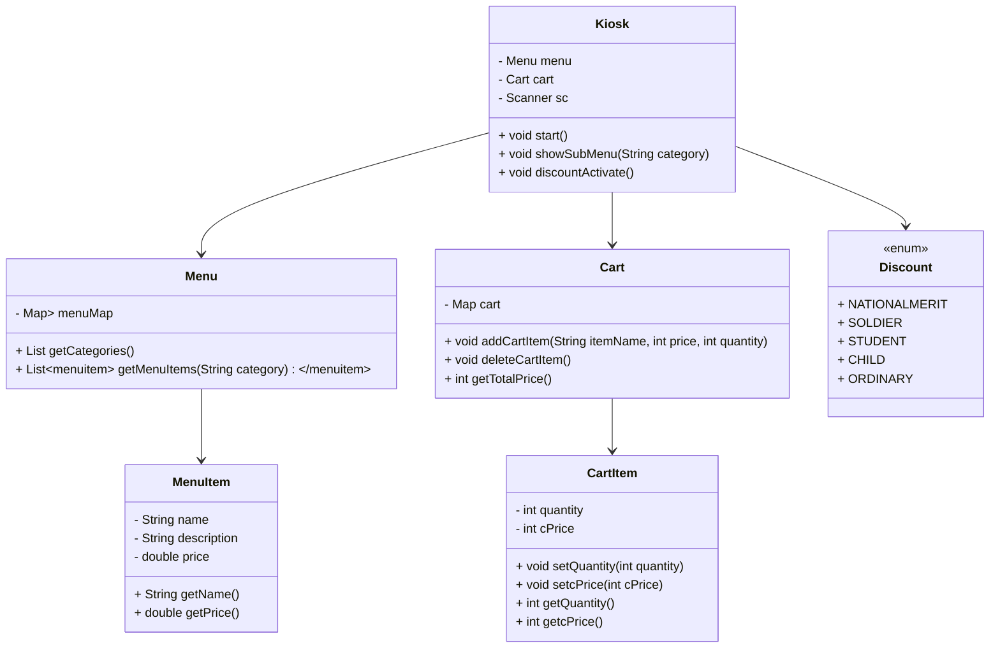
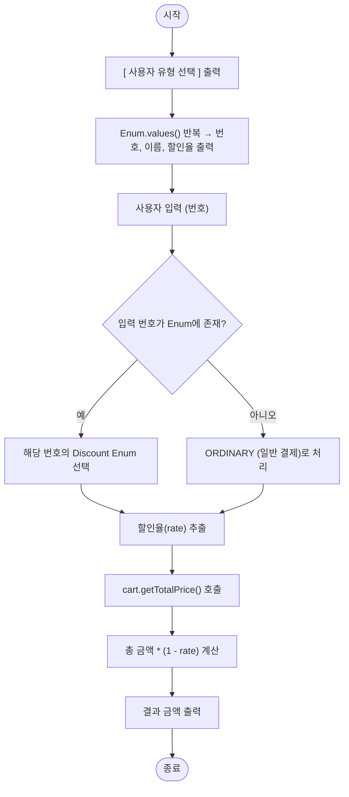

# �KIOSK V7 Project

Java를 활용해 객체지향 프로그래밍 원칙(OOP) 을 적용한 콘솔 기반 키오스크 시스템
유형별 할인 기능, 장바구니 관리, 결제 기능 등을 포함한 통합형 키오스크 프로그램

---

## 📋 프로젝트 개요

이 프로젝트는 객체지향 프로그래밍(OOP) 의 기본 원칙을 실습하기 위해 설계된 단계별 키오스크 시스템입니다.
메뉴 선택, 장바구니 추가, 결제, 할인 기능까지 포함하며
각 기능을 별도의 클래스로 모듈화하여 유지보수성과 확장성을 높였습니다.

---

## 🎯 주요 기능

### ✅ [필수] Lv.1 - 기본 키오스크 기능
- `Scanner`로 사용자 입력 처리  
- 메뉴 카테고리(버거, 음료, 디저트) 표시 및 선택  
- 반복문과 조건문으로 입력 제어 및 예외 처리  
- `List`, `Map` 등을 활용한 메뉴 관리  

---

### ✅ [필수] Lv.2 ~ Lv.5 - 객체 지향 구조화
- **MenuItem** : 개별 음식 정보를 관리하는 클래스  
- **Menu** : 카테고리별 메뉴 목록을 관리하는 클래스  
- **Kiosk** : 전체 실행 흐름 제어 및 사용자 입력 처리  
- **Cart** : 장바구니에 담긴 메뉴 및 수량, 가격 관리  
- **Discount (Enum)** : 사용자 유형별 할인율 관리  

---

### 💪 [도전] Lv.1 - 장바구니 및 결제 기능 추가
- 장바구니에 메뉴 추가 및 수량 조절 기능  
- 현재 장바구니 내역 및 총 금액 출력  
- 결제 시 장바구니 초기화 및 완료 메시지 출력  

---

### 💎 [도전] Lv.2 - Enum을 활용한 할인 기능
- `Discount` Enum을 이용해 사용자 유형별 할인율 관리  
- 유형 선택 시 자동으로 총 금액에서 할인 적용  
- Enum 필드: `selectNum`, `discountName`, `rate`  

| 유형 | 할인율 |
|------|---------|
| 국가유공자 | 10% |
| 군인 | 5% |
| 학생 | 3% |
| 어린이 | 1% |
| 일반 | 0% |

---

## 🏗️ 프로젝트 구조

- [도전과제 Lv.2 기준]


```
src/
└── v7/
    ├── Main.java          # 프로그램 실행 시작점
    ├── Kiosk.java         # 실행 흐름 및 전체 제어
    ├── Menu.java          # 카테고리별 메뉴 관리
    ├── MenuItem.java      # 개별 메뉴 속성 관리
    ├── Cart.java          # 장바구니 기능 관리
    ├── Discount.java      # 사용자 유형별 할인 Enum
```


---


## 🧑‍🏫 클래스 다이어그램





### **집합 관계(1:多)**
- Kiosk - Menu
- Menu - MenuItem
- Order - OrderItem
  
### **연관 관계(1:1)**
- Kiosk - UserType
- Kiosk - KioskView
- Kiosk - Order
- OrderItem - MenuItem


---


## 🧭 클래스별 역할 요약

| 클래스명                | 역할                      | 주요 메서드                                                 | 관계                       |
| ------------------- | ----------------------- | ------------------------------------------------------ | ------------------------ |
| **Kiosk**           | 프로그램의 진입점, 전체 실행 제어     | `start()`, `showSubMenu()`, `discountActivate()`       | Menu, Cart, Discount와 협력 |
| **Menu**            | 카테고리별 메뉴 구성 및 관리        | `getCategories()`, `getMenuItems()`                    | MenuItem을 포함             |
| **MenuItem**        | 개별 메뉴(이름, 가격, 설명) 저장    | `getName()`, `getPrice()`                              | Menu에 의해 사용              |
| **Cart**            | 장바구니 관리(추가/삭제/합계)       | `addCartItem()`, `deleteCartItem()`, `getTotalPrice()` | CartItem을 포함             |
| **CartItem**        | 장바구니 내 개별 품목(수량, 가격) 관리 | `setQuantity()`, `setcPrice()`                         | Cart 내부 요소               |
| **Discount (Enum)** | 사용자 유형별 할인율 관리          | `getRate()`, `getSelectNum()`                          | Kiosk에서 선택, 적용           |


---

# 🧮 Discount Enum & 할인 로직 플로우차트

> `discountActivate()` 메서드의 **데이터 흐름**과 **시스템 흐름**을 정리한 문서입니다.  
> 사용자가 할인 유형을 선택하면, 해당 할인율을 Enum에서 찾아  
> 장바구니 총 금액에 적용한 뒤 최종 결제 금액을 계산합니다.

---

## 🧠 1️⃣ 데이터 흐름 (Data Flow Diagram)

```mermaid
flowchart TD

A[사용자 입력] -->|번호 선택| B[입력값 (int selectnum)]
B --> C[Discount Enum 전체 (values())]
C -->|selectnum 일치| D[선택된 Discount 객체]
D --> E[getRate() 호출 → 할인율 추출]
E --> F[cart.getTotalPrice()]
F --> G[총 금액(total)]
G --> H[할인 적용 (finalTotal = total * (1 - rate))]
H --> I[결과 출력]
```


| 데이터                    | 설명             |
| :--------------------- | :------------- |
| `selectnum`            | 사용자가 입력한 번호    |
| `Discount.values()`    | Enum의 모든 상수 목록 |
| `Discount.getRate()`   | 해당 유형의 할인율 반환  |
| `cart.getTotalPrice()` | 장바구니 총합 금액 반환  |
| `finalTotal`           | 할인 적용 후 최종 금액  |


## ⚙️ 2️⃣ 시스템 흐름 (System Flowchart)




## 📘 4️⃣ 주요 데이터 정의

| 필드                     | 설명                      |
| ---------------------- | ----------------------- |
| `Discount Enum`        | 할인 유형 및 할인율을 정의하는 상수 집합 |
| `values()`             | Enum의 모든 상수를 배열로 반환     |
| `getRate()`            | Enum 상수별 할인율 반환         |
| `selectnum`            | 번호 입력용 식별자              |
| `ORDINARY`             | 일치하지 않는 입력일 때의 기본 타입    |
| `cart.getTotalPrice()` | 장바구니 총합 금액 계산 메서드       |
| `finalTotal`           | 할인율이 적용된 최종 결제 금액       |


---


## 🚀 실행 방법

1. 프로젝트 클론
```bash
git clone [repository-url]
```

2. 각 패키지 내에서 컴파일 및 실행


---


## 🧭 실행 흐름 요약

### 1️⃣ Main.java
```java
public class Main {
    public static void main(String[] args) {
        Kiosk kiosk = new Kiosk();
        kiosk.start();
    }
}
```

### 2️⃣ Kiosk.start()
- 메인 메뉴 표시
- 사용자 입력 처리
- 메뉴 선택 → 장바구니 추가 → 결제 루프 반복

### 3️⃣ Cart 관리
```java
cart.addCartItem(itemName, price, quantity);
cart.deleteCartItem();
cart.addCartItem();
cart.showCart();
// 등... 메서드 다수
```

### 4️⃣ 결제 및 할인 적용
```java
paymentActivate();
discountActivate();
// etc...
```

- Enum을 통해 할인율 선택 및 금액 재계산


---


## 🧮 예시 실행 흐름
```
==============[ MAIN MENU ]==============
1. Burger
2. Drink
3. Dessert
c. 장바구니
p. 결제
0. 종료
=========================================
>> 메뉴 번호 입력: 1

==============[ BURGER MENU ]==============
1. ShackBurger | W 6.9 | 토마토, 양상추, 쉑소스가 토핑된 치즈버거
2. SmokeShack  | W 8.9 | 베이컨, 체리페퍼와 쉑소스가 토핑된 치즈버거
c. 장바구니   p. 결제   0. 뒤로가기
=========================================
>> 메뉴 번호 입력: 1

선택한 메뉴: ShackBurger | W 6.9 | 토마토, 양상추, 쉑소스가 토핑된 치즈버거
장바구니에 추가하시겠습니까? (y/n): y
수량을 입력해주세요: 2
ShackBurger 2개가 장바구니에 추가되었습니다.

[ 결제 확인 ]
총 금액: W 13.8
[ 사용자 유형 선택 ]
1. 국가유공자 (10%)
2. 군인 (5%)
3. 학생 (3%)
4. 어린이 (1%)
5. 일반 (0%)
>> 할인 유형 번호 입력 : 2
총 금액: W 13.8 → 할인 적용 후: W 13.1
결제가 완료되었습니다. 감사합니다!
```


---


## 🛠️ 기술 스택

- **언어**: Java
- **자료구조**: List, Map(LinkedHashMap<key=카테고리,value=Cart타입List>)
- **디자인 패턴**: 캡슐화, Getter/Setter 패턴
- **OOP 개념**: 캡슐화, 정보 은닉, 단일 책임 원칙 (SRP)
- **기술 요소**: Enum, Scanner, Stream API 일부


---


## 📚 학습 포인트

- 클래스 분리 설계와 책임 할당
- Enum을 이용한 할인 관리
- Scanner 입력과 예외 처리 패턴
- List와 Map의 조합을 통한 데이터 관리 구조화
- 캡슐화를 통한 안전한 데이터 접근


---


## 🔄 버전 히스토리

| 버전       | 주요 변경 사항                     |
| -------- | ---------------------------- |
| **v1.0** | 배열 기반 키오스크 기본 구조 완성          |
| **v2.0** | MenuItem 및 Menu 클래스 분리       |
| **v3.0** | Cart 클래스 추가 및 장바구니 기능 완성     |
| **v4.0** | 결제 기능 및 UI 개선                |
| **v5.0** | 입력 예외 처리 및 흐름 제어 강화          |
| **v6.0** | 문자 명령(c, p) 기능 추가            |
| **v7.0** | Enum(Discount) 추가 및 할인 기능 구현 |


---


## 👤 작성자

김동욱 (Kim Dongwook)
Java 기반 콘솔 키오스크 프로젝트
ver.7 – OOP, Enum, Collection, Stream, Lambda...etc 실습 중심 과제
